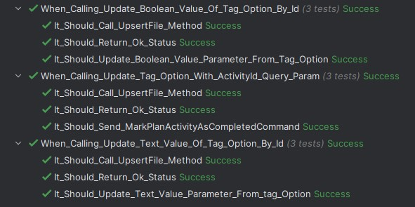

# LoremFooBar.SimpleGwt.NUnit

> A very simple Given-When-Then testing library for NUnit

## Usage

```c#
// CalculatorTests/When_Adding_Two_Numbers.cs

public class When_Adding_Two_Numbers : SpecificationBase
{
    private int _num1;
    private int _num2;
    private Calculator _calc;
    private int _sum;

    public override void Given()
    {
        _num1 = 7;
        _num2 = 3;
    }

    public override void When()
    {
        _sum = _calc.Add(_num1, _num2);
    }

    [Then]
    public void It_Should_Return_The_Sum_Of_The_Two_Numbers()
    {
        _sum.Should().Be(10);
    }
}
```

## Recommendations

1. Use underscore as separator for class and test names, to make it easier to read.
2. You can add multiple "Then" cases to test multiple aspects of the same behavior ("When").

If you follow these recommendations you can get a nice description of your app behavior in test explorer:


